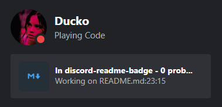
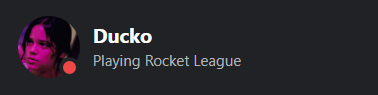
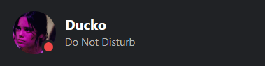
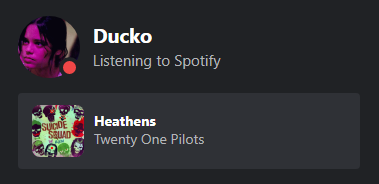

<h1 align="center">Discord README Badge</h1>

Working in an IDE with Rich Presence on? Show off what you're working on with a README badge! Comes as a svg you can add anywhere you'd like. Built by leveraging Vercel's serverless functions.

## Getting started

First off, you will need your Discord user ID. If you're unsure how to get your Discord user ID, follow [this guide](https://support.discord.com/hc/en-us/articles/206346498-Where-can-I-find-my-User-Server-Message-ID-).

In order to grab your Discord status and Rich Presence data, you will have to join [this discord server](https://discord.gg/rTT52gJC3J).

Once you've joined, you can add a badge to your profile using this snippet:

```

```

It should look something like this:

<p></p>

## Card states

The card will only display certain games. Since this is meant to show off what you're working on, they are IDEs and creative programs. The full list of shown games can be found at [allowlistGames.js](./src/allowlistGames.js). If there are missing ones you would like to add, create a pull request.

> **Note**
> If you're adding something allowListGames.js, please write the program name in lowercase.

If the game you're playing does not have rich presence, it will look something like this:

<p></p>

If you're not playing anything, it will just show your status:

<p></p>

If you're listening to some tunes on Spotify, it will show what you're listening to:

<p></p>